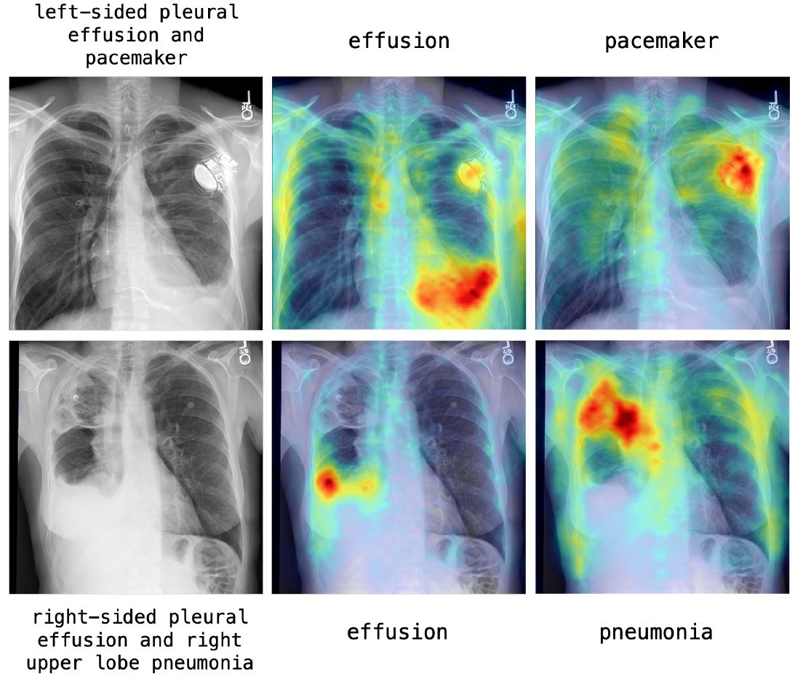

# RoentGen:  A Vision-Language Foundation Model for Chest X-Ray Generation

RoentGen is a domain-adapted latent diffusion model capable of generating high-quality, text-conditioned chest X-rays (CXRs). This repository contains the code and resources for our paper "[A vision–language foundation model for the generation of realistic chest X-ray images](https://www.nature.com/articles/s41551-024-01246-y)" published in Nature Biomedical Engineering.

<p align="center"></p>

## Project Overview

RoentGen addresses the challenge of generating realistic medical images by fine-tuning a large, general domain-pre-trained vision-language latent diffusion model (Stable Diffusion) to the medical domain. Our model demonstrates the ability to generate high-fidelity CXRs controllable with on free-form medical text prompts.

For more details, visit our [project page](https://stanfordmimi.github.io/RoentGen/).


## Model Weights

Access to the RoentGen model weights is provided to researchers credentialed for MIMIC-CXR access. To request access, please [fill out this form](https://forms.gle/9T7AdS2kPwtMq2pj8).

## Model Card

Please refer to the supplementary materials of the paper for a model card for RoentGen v1.0.

## Citation

If you use RoentGen in your research, please cite our paper:

```bibtex
@Article{Bluethgen2024,
  author={Bluethgen, Christian
    and Chambon, Pierre
    and Delbrouck, Jean-Benoit
    and van der Sluijs, Rogier
    and Po{\l}acin, Ma{\l}gorzata
    and Zambrano Chaves, Juan Manuel
    and Abraham, Tanishq Mathew
    and Purohit, Shivanshu
    and Langlotz, Curtis P.
    and Chaudhari, Akshay S.},
  title={A vision--language foundation model for the generation of realistic chest X-ray images},
  journal={Nature Biomedical Engineering},
  year={2024},
  month={Aug},
  day={26},
  issn={2157-846X},
  doi={10.1038/s41551-024-01246-y},
  url={https://doi.org/10.1038/s41551-024-01246-y}
}
```
